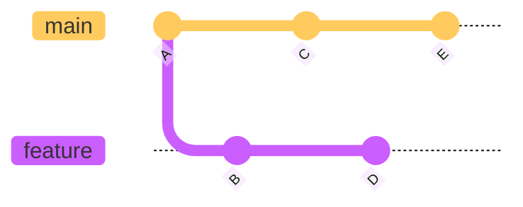
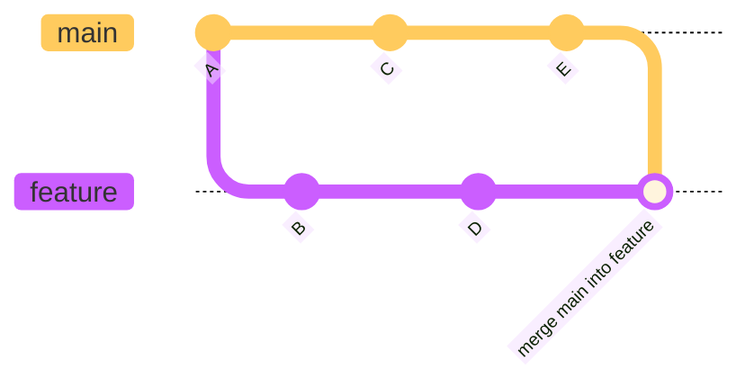
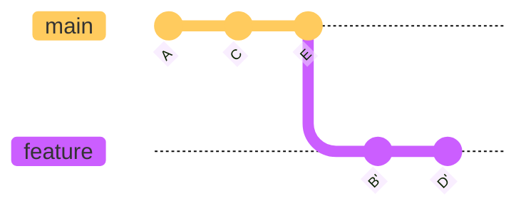

 # Oppgave 4
 I denne oppgaven skal vi følge en tilnærmet vanlig utviklingsflyt.
 Om du jobber alene på et prosjekt, går det fint an å gjøre utvikling i main-branchen. 
 Om man jobber i et team så er dette sjelden god kotyme.
 En vil da som regel utføre endringene i en feature-branch. 
 Som regel vil man jevnlig, eller i alle fall når utviklingen er ferdig, 'pushe' branchen sin opp sentralt.
 Denne vil så danne grunnlaget for en `Pull Request` (PR), der kodeendringene gjennomgå en vurdering av andre på teamet før en tar endringene inn i main-branchen.
 
Om en jobber alene, eller i et mindre team, vil man kanskje merge endringene inn i `main` lokalt før en pusher dette opp sentralt.

## Opprette en Feature-Branch
Når man oppretter en ny branch, så vil denne ta utgangspunkt i det stedet i historien der en for øyeblikket står.
Om du står i en utdatert versjon av `main`, eller i en 'gammel' feature branch, vil dette være koden du tar med deg videre i den nye branchen.

Det er derfor viktig at en henter eventuelle nye endringer fra det sentrale repoet.
Dette gjøres med kommandoen `pull`. Pull er en kombinasjon av `fetch` og `merge`. 
Man kan også velge å legge til `--rebase`, men dette vil ikke ha noen innvirkning med mindre en har lokale commits som ikke er pushet opp sentralt.

Om man kjører
```shell
git checkout main
git pull origin main
```
vil man som regel ha et godt utgangspunkt for å lage en ny feature-branch.

Opprette en branch og gjøre denne aktiv kan man gjøre på to måter. 
```shell
git branch Oppgave4
git checkout Oppgave4
```
Vil først opprette en ny branch, om navnet ikke er brukt fra før, for så skifte fokus til denne nye branchen.
```shell
git checkout -b Oppgave4
```
Vil oppnå det samme i en operasjon.
Om en nå kjører `git status` vil en typisk få følgende utskrift:
```text
On branch Oppgave4
nothing to commit, working tree clean
```
Om det var endringer, som ennå ikke var push-et der du var, vil disse følge med over i den nye branchen.

## Gjøre endringer og committe disse
Etter at det er gjort endringer i repoet, finnes i utgangspunktet disse endringene i dine lokale filer. 
Om du nå bare utfører en `git commit` vil ikke disse endringene komme med. 
Git commit forholder seg kun til endringer som er 'staget'. Det vil si at endringer er inkludert i en 'BLOB', 
og om det er nye filer at dennes 'BLOB' er inkludert i et 'tree'.
Dette gjøres med kommandoen `git add`

`git add fil1 fil2` vil 'stage' to navngitte filer. Dette er i hovedsak aktuelt om du har endringer du vil spre på flere commits.

`git add .` vil legge til alle filer, nye og endrede, til som staget.

En kan hoppe over `git add` om en kjører `git commit -a`. Dette legger til alle endringer som en del av commit-en, 
men nye filer vil ikke bli lagt til.

Om en kjører `git commit` vil en få opp en editor får å skrive en commit-melding.
`git commit -m "<Commit melding her>"`vil gjøre dette i en operasjon.

1) Om du ikke har opprettet en `Oppgave4` branch, gjør det nå.
2) I folderen `Oppgaver/Oppgave4` ligger det en fil `en-eksisterende-fil.txt`. Gjør noen endringer i denne og lagre.
3) I samme folder, opprett en fil og gi den litt innhold.
4) Kjør 
   ```shell
   git add .
   git commit -m "Oppgave 4"
   ```
   Om du nå kjører `git status` vil du få noe som
   ```text
   On branch Oppgave4

   nothing to commit, working tree clean
   ```

Hvor ofte en commit-er endringer er litt personlige preferanser og kanskje noe en har blitt enige om i teamet.
Dette vil kunne variere fra enkelte som lager en commit der andre ville trykket 'save'.
Andre igjen lager en stor commit når en feature er ferdig. Personlig havner jeg nok i en kategori midt i mellom.

Om det er kode en skriver, vil det typisk være en god regel at en commit skal ikke ha kompileringsfeil og tester skal kjøre. 
## Endringer fra Main-Branch

Om en feature tar så lang tid at det rekker å skje endringer i `main` før dine egne endringer er det lurt å jevnlig ta disse inn i din branch.
Dette kan gjøres på to måter: Merge av `main` inn i din feature branch eller å 'rebase' din feature branch på toppen av `main`
Det er praktisk å gjøre dette på main sin `remote tracking branch` som kan navngis med `origin/main`.

For å være sikker på at denne er i synk med det som ligger sentralt, kjører man `git fetch`
Deretter kjører man enten `git merge origin/main` eller `git rebase origin/main`

Om en har følgende historikk:

Om en kjører `git merge origin/main`, vil en få:

Om en kjører `git rebase origin/main` vil en få en mer lineær historikk:

En diskusjon som aldri vil bli ferdig er om det ene er bedre enn det andre. 
Her er det stor grad av personlige preferanser som spiller inn.


