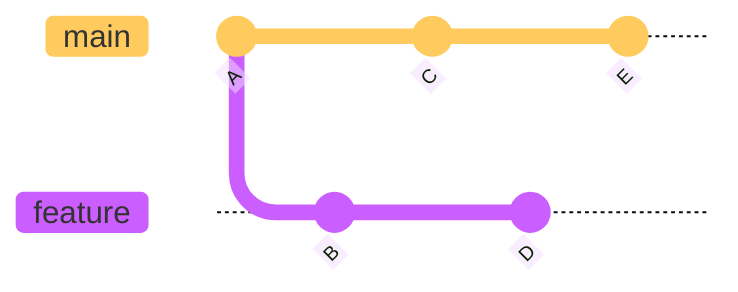
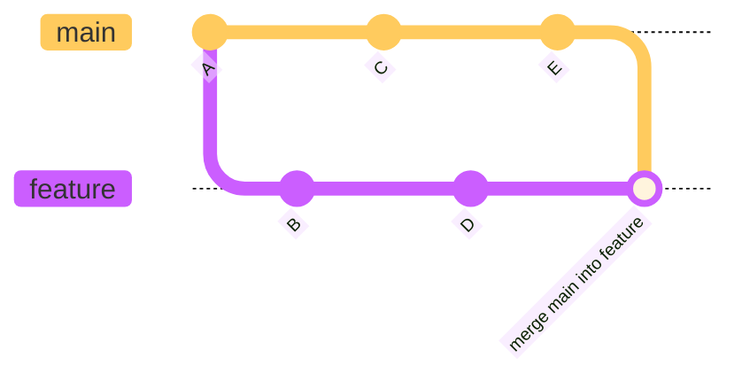
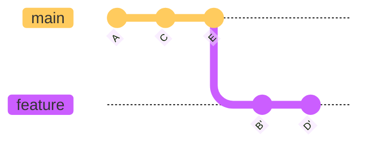

# Endringer fra Main-Branch

Om en feature tar så lang tid at det rekker å skje endringer i `main` før dine egne endringer er det lurt å jevnlig ta disse inn i din branch.
Dette kan gjøres på to måter: Merge av `main` inn i din feature branch eller å 'rebase' din feature branch på toppen av `main`
Det er praktisk å gjøre dette på main sin `remote tracking branch` som kan navngis med `origin/main`.

For å være sikker på at denne er i synk med det som ligger sentralt, kjører man `git fetch`
Deretter kjører man enten `git merge origin/main` eller `git rebase origin/main`

Om en har følgende historikk:

Om en kjører `git merge origin/main`, vil en få:

Om en kjører `git rebase origin/main` vil en få en mer lineær historikk:

En diskusjon som aldri vil bli ferdig er om det ene er bedre enn det andre.
Her er det stor grad av personlige preferanser som spiller inn.

 