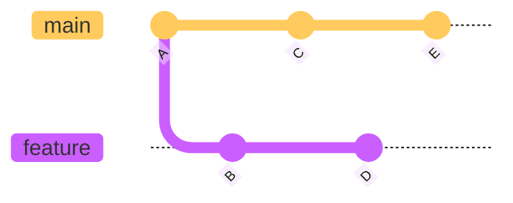
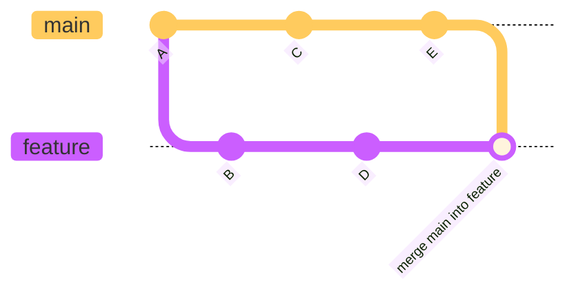
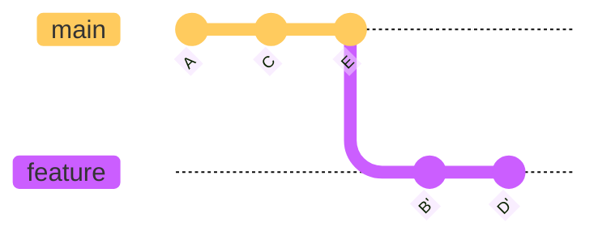
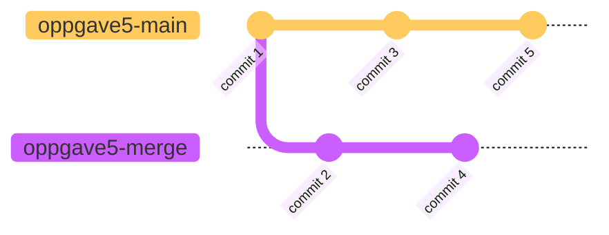

# Endringer fra Main-Branch

Om en feature tar så lang tid at det rekker å skje endringer i `main` før dine egne endringer er ferdig, er det lurt å jevnlig ta disse inn i din branch.
Dette kan gjøres på to måter: Merge av `main` inn i din feature branch eller å 'rebase' din feature branch på toppen av `main`
Det er praktisk å gjøre dette på main sin `remote tracking branch` som kan navngis med `origin/main`.

For å være sikker på at denne er i synk med det som ligger sentralt, kjører man `git fetch`
Deretter kjører man enten `git merge origin/main` eller `git rebase origin/main`

Om en har følgende historikk:

Om en kjører `git merge origin/main`, vil en få:

Om en kjører `git rebase origin/main` vil en få en mer lineær historikk:

En diskusjon som aldri vil bli ferdig er om det ene er bedre enn det andre.
Her er det stor grad av personlige preferanser som spiller inn.
`git rebase` har, etter min mening, noen fordeler og en ulempe i forhold til `git merge`
 - Om din branch har flere commits som er i konflikt med `main`, vil disse løses en og en.     
   Med `git merge` må disse løses på en gang.
 - Historikken blir mer lineær. 
 - Om du gjør dette på en branch som er push-et sentralt, vil den måtte 'force push-es' etter rebase. 
   Om flere jobber på samme branch må dette koordineres.

## Bruke Git Merge
Vi har følgende historikk:


Kjør følgende:
```shell
git checkout oppgave5-merge
git --no-pager log --oneline --graph -3
```
og du skal få noe som likner på 
```text
* 1c5a0c0 (HEAD -> oppgave5-merge, origin/oppgave5-merge) Commit 4
* e0351ee commit 2
* e93750d commit 1
```


 