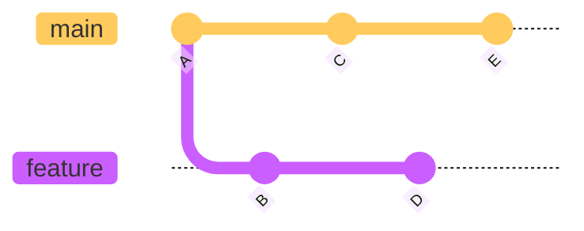
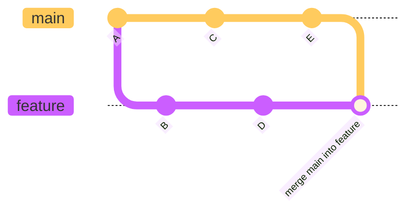
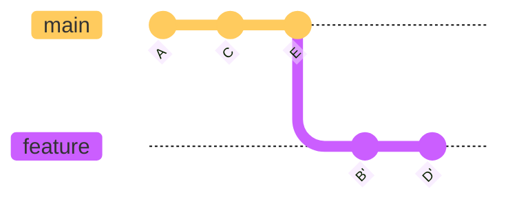
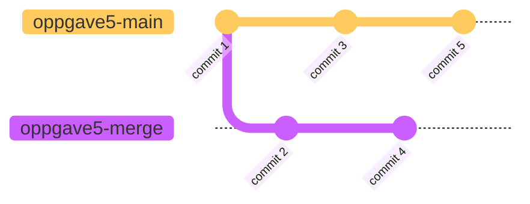
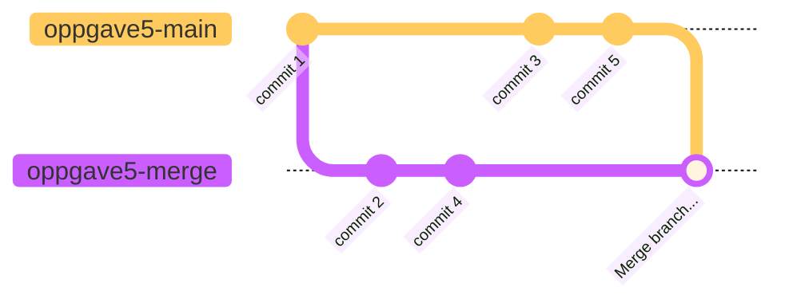
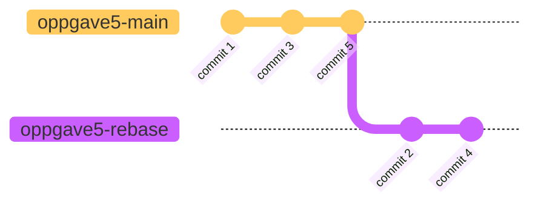

# Endringer fra Main-Branch

Om en feature tar så lang tid at det rekker å skje endringer i `main` før dine egne endringer er ferdig, er det lurt å jevnlig ta disse inn i din branch.
Dette kan gjøres på to måter: Merge av `main` inn i din feature branch eller å 'rebase' din feature branch på toppen av `main`
Det er praktisk å gjøre dette på main sin `remote tracking branch` som kan navngis med `origin/main`.

For å være sikker på at denne er i synk med det som ligger sentralt, kjører man `git fetch`
Deretter kjører man enten `git merge origin/main` eller `git rebase origin/main`

Om en har følgende historikk:

Om en kjører `git merge origin/main`, vil en få:

Om en kjører `git rebase origin/main` vil en få en mer lineær historikk:

En diskusjon som aldri vil bli ferdig er om det ene er bedre enn det andre.
Her er det stor grad av personlige preferanser som spiller inn.
`git rebase` har, etter min mening, noen fordeler og en ulempe i forhold til `git merge`
 - Om din branch har flere commits som er i konflikt med `main`, vil disse løses en og en.     
   Med `git merge` må disse løses på en gang.
 - Historikken blir mer lineær. 
 - Om du gjør dette på en branch som er push-et sentralt, vil den måtte 'force push-es' etter rebase. 
   Om flere jobber på samme branch må dette koordineres.

## Bruke Git Merge
Vi har følgende historikk:


Kjør følgende:
```shell
git checkout oppgave5-merge
git --no-pager log --oneline --graph -3
```
og du skal få noe som likner på 
```text
* 0c0f780 (HEAD -> oppgave5-merge, origin/oppgave5-rebase, origin/oppgave5-merge, oppgave5-rebase) commit 4
* 3aeae84 commit 2
* 72cb8f0 commit 1
```
Om du gjør følgende:
```shell
git checkout oppgave5-main
git --no-pager log --oneline --graph -3
```
får du omtrent
```text
* 506a016 (HEAD -> oppgave5-main, origin/oppgave5-main) commit 5
* 1cf1868 commit 3
* 72cb8f0 commit 1
```
Om vi nå gjør en merge av `oppgave5-main` inn i `oppgave5-merge`:
```shell
git checkout oppgave5-merge
git merge origin/oppgave5-main
```
Vil vi få en ny historikk med en merge-commit om vi kjører `git --no-pager log --oneline --graph -6`:
```text
*   2ed8003 (HEAD -> oppgave5-merge) Merge branch 'oppgave5-main' into oppgave5-merge
|\  
| * 506a016 (origin/oppgave5-main, oppgave5-main) commit 5
| * 1cf1868 commit 3
* | 0c0f780 (origin/oppgave5-rebase, origin/oppgave5-merge, oppgave5-rebase) commit 4
* | 3aeae84 commit 2
|/  
* 72cb8f0 commit 1
```
eller


Om vi nå prøver å push-e disse endringene opp til server med
```shell
git push origin oppgave5-merge
```
vil vi se at dette går helt greit, og at responsen blir noe liknende
```text
Enumerating objects: 10, done.
Counting objects: 100% (10/10), done.
Delta compression using up to 16 threads
Compressing objects: 100% (4/4), done.
Writing objects: 100% (4/4), 800 bytes | 800.00 KiB/s, done.
Total 4 (delta 1), reused 0 (delta 0), pack-reused 0 (from 0)
To /Users/kristian/projects/rasmantuta/repo.git
   0c0f780..2dcf65f  oppgave5-merge -> oppgave5-merge
```


## Bruke Git Rebase
Branch-en `oppgave5-rebase har samme utgangspunkt som `oppgave5-merge`

Kjør følgende:
```shell
git checkout oppgave5-rebase
git --no-pager log --oneline --graph -3
```
og du skal nå få ca. samme som i forrige oppgave
```text
* 0c0f780 (HEAD -> oppgave5-rebase, origin/oppgave5-rebase, origin/oppgave5-merge) commit 4
* 3aeae84 commit 2
* 72cb8f0 commit 1
```
Om du gjør følgende:
```shell
git checkout oppgave5-main
git --no-pager log --oneline --graph -3
```
får det samme som i forrige oppgave
```text
* 506a016 (HEAD -> oppgave5-main, origin/oppgave5-main) commit 5
* 1cf1868 commit 3
* 72cb8f0 commit 1
```
Om vi nå gjør en rebase av `oppgave5-rebase` på toppen av `oppgave5-main`, vil følgende bli gjort:
 - Git går til enden av den branch som det skal rebases på, i dette tilfellet `oppgave5-main`.
 - Deretter legges alle endringer fra `oppgave5-rebase` til en commit av gangen.
   - Om det er konflikter som oppdages når en commit spilles på, må denne løses før vi fortsetter.

Kjør
```shell
git checkout oppgave5-rebase
git rebase origin/oppgave5-main
```
og vi vil få en ny historikk uten en merge-commit.
Om vi kjører `git --no-pager log --oneline --graph -5`: ser vi at commit-ene fra `oppgave5-rebase` har lagt seg etter de fra `oppgave5-main` 
```text
* 068ed66 (HEAD -> oppgave5-rebase) commit 4
* 3614566 commit 2
* 506a016 (origin/oppgave5-main, oppgave5-main) commit 5
* 1cf1868 commit 3
* 72cb8f0 commit 1
```
eller

Om du sammenlikner loggen av `oppgave5-rebase` før og etter at vi har gjennomført rebase, vil du se at SHA-ene til `commit 2` og `commit 4` har endret seg.
Dette er fordi commit-ene har fått ny parent-commit.

Om vi prøver å kjøre 
```shell
git push origin oppgave5-rebase
```
Vil dette feile med at dette ikke lar seg gjøre:
```text
To /Users/kristian/projects/rasmantuta/repo.git
 ! [rejected]        oppgave5-rebase -> oppgave5-rebase (non-fast-forward)
error: failed to push some refs to '/Users/kristian/projects/rasmantuta/repo.git'
hint: Updates were rejected because the tip of your current branch is behind
hint: its remote counterpart. If you want to integrate the remote changes,
hint: use 'git pull' before pushing again.
hint: See the 'Note about fast-forwards' in 'git push --help' for details.
```
Dette er fordi vi ved `rebase` har stokket om på historikken. 

For at vi skal kunne push-e etter en `rebase` så må vi tvinge denne opp ved å bruke `forced push`.
Dette er litt skummelt og enkelte vil anbefale mot det. 

Å bruke `forced push` på `main` skal vi ikke gjøre med mindre det er siste utvei. 
( Eller om du jobber i et repo helt aleine. )

Om du jobber i en feature branch, så er dette helt innenfor.
Om andre jobber på samme branch, er det greit å koordinere dette, så ingen andre push-er opp endringer mens en selv  gjør en `forced push`.

kjør 
```shell
git push -f origin oppgave5-rebase
```
og endringene skal nå gå greit gjennom.
```text
Enumerating objects: 13, done.
Counting objects: 100% (13/13), done.
Delta compression using up to 16 threads
Compressing objects: 100% (10/10), done.
Writing objects: 100% (10/10), 2.43 KiB | 2.43 MiB/s, done.
Total 10 (delta 3), reused 2 (delta 0), pack-reused 0 (from 0)
To /Users/kristian/projects/rasmantuta/repo.git
 + 0c0f780...12e6b78 oppgave5-rebase -> oppgave5-rebase (forced update)
```

[Oppgave 6](./Oppgave6.md)
