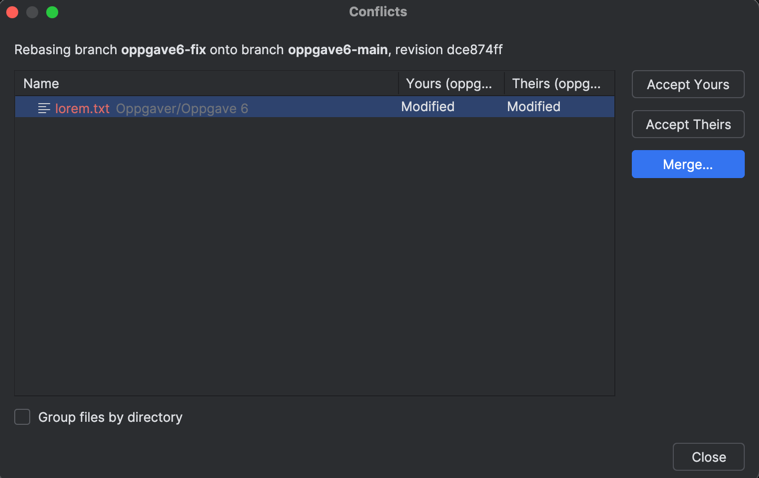
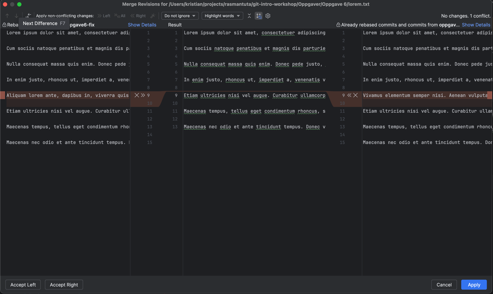

# Oppgave 6

I denne oppgaven skal vi se litt på konfliktløsing. 
Om vi gjør en operasjon så som `merge`, `pull`, `rebase`, `stash pop` osv når det har blitt gjort endringer på samme sted i en fil både i deres versjon og vår versjon, så vil vi få en konflikt.
Git kan ingenting om kontekst, så som språk, filtyper osv. og kan derfor ikke gjøre et valg med hensyn på om en eller flere endringer skal være med eller droppes.

Det som derfor skjer i denne type operasjoner ved konflikter, er at operasjonen stoppes og en må ta stilling til hvordan konflikten skal løses. 
Deretter gjenopptar en den stoppede operasjonen. Om det ikke er ytterligere problemer, fullføres denne.

Når Git stopper en slik operasjon, blir det gitt ganske gode indtruksjoner om hvordan en kommer seg videre eller avbryter.

## Manuell Konfliktløsning
I branch--en `oppgave6-main` `commit 1` er det lagt til en ny fil: `/Oppgaver/Oppgave 6/lorem.txt` . 
Deretter er det opprettet en ny branch `oppgave6-fix` der det er lagt til ett nytt avsnitt i teksten i commit-en `commit 2`.
I `oppgave6-main` er det så lagt til et annet avsnitt på samme sted i en commit med melding `commit 3`.

Om du sjekker ut de to branch-ene en etter en og ser på fila, vil du se at den ene har lagt til
```text
Vivamus elementum semper nisi. Aenean vulputate eleifend tellus. Aenean leo ligula, porttitor eu, consequat vitae, eleifend ac, enim.
```
mens den andre har fått 
```text
Aliquam lorem ante, dapibus in, viverra quis, feugiat a, tellus. Phasellus viverra nulla ut metus varius laoreet. Quisque rutrum. Aenean imperdiet.
```
Sjekk ut `oppgave6-main` og merge inn `oppgave6-fix` med
```shell
git checkout oppgave6-main
git merge oppgave6-fix
```

Siden det nå er en konflikt, vil operasjonen stoppe med følgende melding
```text
Auto-merging Oppgaver/Oppgave 6/lorem.txt
CONFLICT (content): Merge conflict in Oppgaver/Oppgave 6/lorem.txt
Automatic merge failed; fix conflicts and then commit the result.
```
Om vi kjører `git status` vil den vise dette:
```text
On branch oppgave6-main
You have unmerged paths.
  (fix conflicts and run "git commit")
  (use "git merge --abort" to abort the merge)

Unmerged paths:
  (use "git add <file>..." to mark resolution)
        both modified:   Oppgave 6/lorem.txt

no changes added to commit (use "git add" and/or "git commit -a")
```

Om vi ser i fila `Oppgaver/Oppgave 6/lorum.txt` så vil vi litt nede på side se
```text
<<<<<<< HEAD
Vivamus elementum semper nisi. Aenean vulputate eleifend tellus. Aenean leo ligula, porttitor eu, consequat vitae, eleifend ac, enim.
=======
Aliquam lorem ante, dapibus in, viverra quis, feugiat a, tellus. Phasellus viverra nulla ut metus varius laoreet. Quisque rutrum. Aenean imperdiet.
>>>>>>> oppgave6-fix
```
Dette er formatet git bruker for å indikere konflikt. 
Om det er flere konflikter i samme file, vil det være gjentakelser i dette mønsteret.
En enkel måte å finne dette er å søke i fila etter `<<<<<<`. Dette skulle være et mønster som ikke alt for ofte ligger i en fil med vilje.
En kan også se hvor de enkelte delene av konflikten har sitt opphav. 
`HEAD` er enden av gjeldende branch, altså `oppgave6-main`. `oppgave6-fix`er åpenbart den andre branch-en.

Det en deretter må gjøre, er å vurdere hva som egentlig skal ligge i fila. 
I dette tilfellet er det enkelt. 
Begge deler skal med, og vi kan bare slette merkingen til git slik at vi sitter igjen med
```text
In enim justo, rhoncus ut, imperdiet a, venenatis vitae, justo. Nullam dictum felis eu pede mollis pretium. Integer tincidunt. Cras dapibus.

Vivamus elementum semper nisi. Aenean vulputate eleifend tellus. Aenean leo ligula, porttitor eu, consequat vitae, eleifend ac, enim.

Aliquam lorem ante, dapibus in, viverra quis, feugiat a, tellus. Phasellus viverra nulla ut metus varius laoreet. Quisque rutrum. Aenean imperdiet.

Etiam ultricies nisi vel augue. Curabitur ullamcorper ultricies nisi. Nam eget dui. Etiam rhoncus.
```
og lagre.

Så, om det er flere konflikter, løser vi disse, lagrer og følger instruksjonene fra git.
Om vi ser på teksten fra `git status` så sier den 
```text
no changes added to commit (use "git add" and/or "git commit -a")
```
Her kan vi da for eksempel kjøre `git commit -a`. 
Da får vi opp en editor med forslag til commit-melding: 
```text
Merge branch 'oppgave6-fix' into oppgave6-main
```
En kan velge å beholde denne eller skrive en litt mer utfyldende tekst med hvilken konflikt som ble løst.
Om du legger til linjeskift i en commit-melding, så vil all tekst komme med, men bare første linje vil vises i `git log`

Om du kjører `git --no-pager log --oneline --graph -4` vil du se at de to branchene er merg-et med en ny commit med meldingen du la til:
```text
*   5b8b70a (HEAD -> oppgave6-main) Merge branch 'oppgave6-fix' into oppgave6-main
|\  
| * 00c8b6c (origin/oppgave6-fix, oppgave6-fix) lagt til nytt avsnitt
* | dce874f (origin/oppgave6-main) lagt til avsnitt
|/  
* 9c10828 Lagt til tekst
```

## Hjelp koden kompilerer ikke
Konflikten vi løste over var temmelig enkel. 
I kode vil typisk liknende konflikter være to funksjoner lagt til i slutten av en fil. 
Veldig ofte er det mer komplisert. 

> [!IMPORTANT]
> Etter å ha løst en konflikt, er det viktig å kompilere og kjøre tester før en push-er koden remote. 
> Det er mye mindre styr å rydde opp i dette lokalt heller enn å fikse det etter at koden er push-et til main.

Uansett hvor mye en kludrer det til, så kan man alltid gå tilbake til startpunktet å prøve igjen.

Om vi ser på loggen vi fikk etter at vi var ferdig med å merge, så ser vi at siste commit på `oppgave6-main` har SHA `dce874f`
Om vi vil tilbake dit kan vi kjøre `git reset --hard dce874f` på `oppgave6-main`. 

Om du nå kjører `git log` så ser du at vi er tilbake til slik det var før `merge`.

Et annet veldig viktig verktøy å ha er `git reflog`.
Alle operasjoner vi gjør legger spor i `reflog`. 
Om vi hadde kjørt `git reflog` før vi resatte branch-en ville vi fått noe liknende
```text
5b8b70a (HEAD -> oppgave6-main) HEAD@{0}: commit (merge): Merge branch 'oppgave6-fix' into oppgave6-main
dce874f (origin/oppgave6-main) HEAD@{1}: checkout: moving from oppgave6-fix to oppgave6-main
00c8b6c (origin/oppgave6-fix, oppgave6-fix) HEAD@{2}: commit: lagt til nytt avsnitt
9c10828 HEAD@{3}: checkout: moving from oppgave6-main to oppgave6-fix
dce874f (origin/oppgave6-main) HEAD@{4}: commit: lagt til avsnitt
9c10828 HEAD@{5}: commit: Lagt til tekst
369d94f (origin/main, origin/HEAD, main) HEAD@{6}: checkout: moving from main to oppgave6-main
369d94f (origin/main, origin/HEAD, main) HEAD@{7}: commit: Start Oppgave 6
```
På linje to ser vi resultatet av å kjøre `git checkout oppgave6-main`. 
En ser at SHA-en i begynnelsen av denne linja er den samme som vi brukte i `reset` over.

Selv etter kompliserte omskrivinger av git-historien vil de tidligere commit-ene ligge i `reflog`.
En kan dermed alltid gå tilbake til et tidligere punkt i historien.

Om du ikke har kjørt `git reset` som beskrevet over, gjør det nå. Vi skal nå løse samme konflikt under en `rebase`

## Konfliktløsing under rebase

Konfliktløsing under `rebase` er veldig likt det vi gjorde under ´merge`
Hovedforskjellene er at en kan risikere å løse konflikter i samme fila flere ganger. 
Ikke samme konflikt, men om en har sjekket inn endringer i samme fil med flere commits, så vil de måtte løses en commit av gangen.
Potensielt så gjør det den enkelte konflikten enklere å løse.

Det vil heller ikke lages en ny commit etter at en konflikt er løst. Løsningen vil bli lagt inn under den eksisterende commit.

om vi sjekker ut `oppgave6-fix` og rebase-er denne på `oppgave6-main`, så må vi løse samme konflikt en gang til.
Vi kunne også gjort det andre veien, men det er relativt vanlig å løse eventuelle konflikter i din egen branch. Typisk en feature-branch.
```shell
git checkout oppgave6-fix
git rebase oppgave6-main
```
Vi får da teksten 
```text
Auto-merging Oppgaver/Oppgave 6/lorem.txt
CONFLICT (content): Merge conflict in Oppgaver/Oppgave 6/lorem.txt
error: could not apply 00c8b6c... lagt til nytt avsnitt
hint: Resolve all conflicts manually, mark them as resolved with
hint: "git add/rm <conflicted_files>", then run "git rebase --continue".
hint: You can instead skip this commit: run "git rebase --skip".
hint: To abort and get back to the state before "git rebase", run "git rebase --abort".
hint: Disable this message with "git config set advice.mergeConflict false"
Could not apply 00c8b6c... lagt til nytt avsnitt
```
Vi kan løse konflikten på samme måte som over ved å fjerne markeringene i fila og lagre. 

Veien videre, som beskrevet i teksten over er litt anderledes. Her holder det med å legge til fila, ikke lage en commit, og så kjøre `git rebase --continue`.
```shell
git add .
git rebase --continue
```
vi får da 
```text
[detached HEAD 70fec94] lagt til nytt avsnitt
 1 file changed, 2 insertions(+)
Successfully rebased and updated refs/heads/oppgave6-fix.
```
og er ferdig. 

Om vi ser på loggen så vil den vise at commit-ene fra `oppgave6-main` main er lagt før commit-en fra `oppgave6-fix`.
```text
* 70fec94 (HEAD -> oppgave6-fix) lagt til nytt avsnitt
* dce874f (origin/oppgave6-main, oppgave6-main) lagt til avsnitt
* 9c10828 Lagt til tekst
* 369d94f Start Oppgave 6
```
Om vi nå gjør en `git reflog` vil resultatet bli:
```text
70fec94 (HEAD -> oppgave6-fix) HEAD@{0}: rebase (finish): returning to refs/heads/oppgave6-fix
70fec94 (HEAD -> oppgave6-fix) HEAD@{1}: rebase (continue): lagt til nytt avsnitt
dce874f (origin/oppgave6-main, oppgave6-main) HEAD@{2}: rebase (start): checkout oppgave6-main
00c8b6c (origin/oppgave6-fix) HEAD@{3}: checkout: moving from main to oppgave6-fix
63913d7 (main) HEAD@{4}: commit: wip
0df57f6 (origin/main, origin/HEAD) HEAD@{5}: commit: oppgave 6, start rebase
910ecfc HEAD@{6}: commit: Litt mere oppgave 6
369d94f HEAD@{7}: checkout: moving from oppgave6-main to main
dce874f (origin/oppgave6-main, oppgave6-main) HEAD@{8}: reset: moving to dce874f
5b8b70a HEAD@{9}: commit (merge): Merge branch 'oppgave6-fix' into oppgave6-main
```
og vi ser at vi kan finne tilbake til startpunktet i den linja som kommer før den som inneholder teksten `rebase (start)`.
Det er den som starter med SHA-en `00c8b6c`.

## Konkliktløsing med grafisk verktøy

Det finnes flere verktøy for å løse konflikter med et grafisk brukergrensesnitt.

De fleste IDE-er, så som IntelliJ og Visual Studio Code, vil ha dette innebygget.

Beskrivelsen under er tatt fra IntelliJ, der en finner det under menyen `Git -> Resolve Conflict`.
Dette åpner først følgende dialog




Her listes alle filer med konflikt opp. En kan velge en og en og trykke  ´Merge...`


En får da opp et vindu med de to orginalene på hver side og resultatet i midten.

Hver konflikt vises i en anne farge, og man kan legge den til i resultatet med `>>` eller utelate den men `X`.
Noen ganger, om en konflikt er litt komplisert, må man kanskje også gjøre litt manuelle endringer. 
Det kan gjøres i resultatvinduet.

Når alle konflikter i fila er løst, trykker man `Apply` og en er ferdig med den fila. 
Når alle filer med konflikter er i orden, kan man gå tilbake og kjøre `git rebase --continue`.

[Oppgave 7](./Oppgave7.md)

